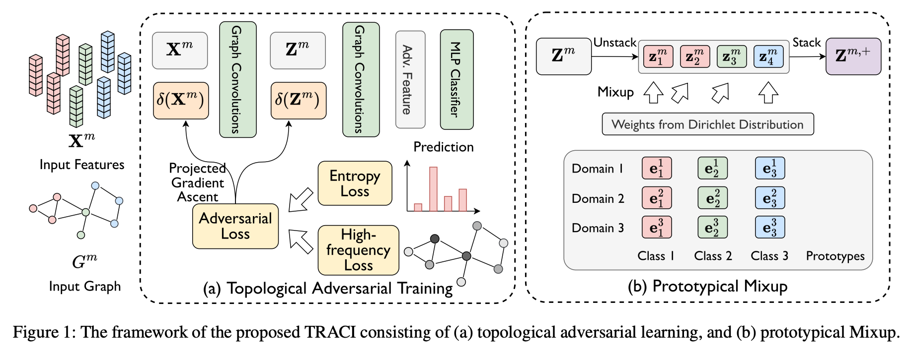

# TRACI: A Data-centric Approach for Multi-Domain Generalization on Graphs (AAAI 2025)

## Abstract

Graph neural networks (GNNs) have gained superior performance in graph-based prediction tasks with a variety of applications such as social analysis and drug discovery. Despite the remarkable progress, their performance often degrades on test graphs with distribution shifts. Existing domain adaptation methods rely on unlabeled test graphs during optimization, limiting their applicability to graphs in the wild. Towards this end, this paper studies the problem of multi-domain generalization on graphs, which utilizes multiple source graphs to learn a GNN with high performance on unseen target graphs. We propose a new approach named Topological Adversarial Learning with Prototypical Mixup (TRACI) to solve the problem. The fundamental principle behind our TRACI is to produce virtual adversarial and mixed graph samples from a data-centric view. In particular, TRACI enhances GNN generalization by employing a gradient-ascent strategy that considers both label prediction entropy and graph topology to craft challenging adversarial samples. Additionally, it generates domain-agnostic node representations by characterizing class-graph pair prototypes through latent distributions and applying multi-sample prototypical Mixup for distribution alignment across graphs. We further provide theoretical analysis showing that TRACI reduces the model's excess risk. Extensive experiments on various benchmark datasets demonstrate that TRACI outperforms state-of-the-art baselines, validating its effectiveness.

## Framework Overview


## Full Paper

The PDF of this paper is available: [[PDF]](https://ojs.aaai.org/index.php/AAAI/article/view/33463/35618).

## Citation

```
@inproceedings{zhao2025traci,
  title={TRACI: A Data-centric Approach for Multi-Domain Generalization on Graphs},
  author={Zhao, Yusheng and Wang, Changhu and Luo, Xiao and Luo, Junyu and Ju, Wei and Xiao, Zhiping and Zhang, Ming},
  booktitle={Proceedings of the AAAI Conference on Artificial Intelligence},
  volume={39},
  number={12},
  pages={13401--13409},
  year={2025}
}
```

## Experiment Environment
* Operating System: Linux (Ubuntu 18.04.6 LTS)
* GPU: NVIDIA A40
* Major Package Requirements (details in requirements.txt)
  * python 3.10
  * pytorch 1.12
  * torch-cluster 1.6
  * torch-scatter 2.0
  * torch-sparse 0.6

## Instructions
### Step 1: Install required packages
```
conda create -n traci
conda activate traci
pip install -r requirements.txt
```

### Step 2: Run the script
```
python run.py --experiment citation_or_protein --gpu your_gpu_id --method traci --source-names the_list_of_source_names --target-name the_target_name
```
